# 🍌 Nano-banana Awesome Prompts


> 🎨 探索 Nano-banana 的无限创意玩法！从二次元到真人，从设计到生活，一切皆有可能！

**持续更新ing......**

## 📖 项目介绍

欢迎来到 **Nano-banana Awesome Prompts** 仓库！🎉 这里收集了 Nano-banana 最有创意、最实用的玩法示例。无论你是设计师、内容创作者，还是单纯喜欢玩 AI 的朋友，这里都有你想要的灵感！

### ✨ 特色功能

- 🎭 **角色扮演与互动**：让虚拟角色活起来
- 🎨 **艺术创作**：从线稿到成品，一键搞定
- 👗 **时尚穿搭**：虚拟试衣，造型随心换
- 🏠 **场景设计**：从平面图到3D渲染
- 🎪 **创意合成**：多元素完美融合
- 📱 **生活应用**：让AI融入日常

### 🗂️ 内容目录

- [🎬 AI 当导演，搞怪组合随意同框](#-ai-当导演搞怪组合随意同框)
- [🌗 一半真人，一半漫画](#-一半真人一半漫画)
- [🎀 个性化挂件](#-个性化挂件)
- [💄 人物美化](#-人物美化)
- [🧸 喝的饮品变成抱枕收](#-喝的饮品变成抱枕收)
- [🔄 场景替换](#-场景替换)
- [🕶️ 场景标注（一秒拥有"AR眼镜"）](#️-场景标注一秒拥有ar眼镜)
- [🕺 控制人物姿势（凹造型）](#-控制人物姿势凹造型)
- [👔 模特穿衣服](#-模特穿衣服)
- [✏️ 神笔马良（线框图变真人实物）](#️-神笔马良线框图变真人实物)
- [🎨 绘画过程](#-绘画过程)
- [🏡 装修搞定](#-装修搞定)
- [🎎 轻松定制你的专属手办](#-轻松定制你的专属手办)
- [🍳 食谱玩法](#-食谱玩法)

### 🔗 如何访问Nano-banana

访问链接请查看：[examples/nano-banana地址.url](examples/nano-banana地址.url)

---

## 🎬 AI 当导演，搞怪组合随意同框

### 二次元人物组合

画单人不牛，画多人互动才见真章。我把我最喜欢的两个动漫角色扔进去，再给个高难度互动姿势，看它会不会翻车。两个角色的身份都认对了，姿势也基本还原了，没有出现"缝合怪"。就是两个人身体接触的地方有点糊，不够清晰。看来 AI 在理解"力"和"物理接触"上还有进步空间，但能做到这个程度，已经能秒杀 99% 的绘画小白了。

 

**prompt:**
```
Have these two characters fight using the pose from Figure 3.Add appropriate visual backgrounds and scene interactions,Generated image ratio is 16:9
```

### 二次元单身狗的忧伤

这个目前在 Twitter 上爆火的生图（超千万级的曝光/转发），我把它命名为： 二次元单身狗蛋蛋的忧伤 我把它 nano banana 上可复用模版调出来了

 

**prompt:**
```
A cinematic scene inside a fast food restaurant at night.   Foreground: a lonely table with {food_items}, and a smartphone shown large and sharp on the table, clearly displaying the uploaded anime/game character image.   A hand is reaching for food, symbolizing solitude.   Midground: in the blurred background, a couple is sitting together.   One of them is represented as a cosplayer version of the uploaded character:   - If the uploaded character is humanoid, show accurate cosplay with hairstyle, costume, and signature props.   - If the uploaded character is non-humanoid (mecha, creature, mascot, etc.), show a gijinka (humanized cosplay interpretation) that carries clear visual cues, costume colors, and props from the reference image (armor pieces, wings, ears, weapon, or iconic accessories).   The other person is an ordinary human, and they are showing intimate affection (kissing, holding hands, or sharing food).   Background: large glass windows, blurred neon city lights outside.   Mood: melancholic, bittersweet, ironic, cinematic shallow depth of field.   [reference: the uploaded image defines both the smartphone display and the cosplay design, with visible props emphasized]
```

### 将十三个物品合并为一个图

使用Gemini 2.5 Flash Image（Nano Banana）将13张图片合并成一张。这种拼贴方法真是太疯狂了！我真的很惊讶它能做到这一点，但我觉得我现在已经接近它的极限了，但即使在13个元素的情况下，它仍然能保持一致性。然而，一旦你开始处理像这样疯狂数量的元素时，详细的提示就非常重要了。 🤯


**prompt:**
```
A model is posing and leaning against a pink bmw. She is wearing the following items, the scene is against a light grey background. The green alien is a keychain and it's attached to the pink handbag. The model also has a pink parrot on her shoulder. There is a pug sitting next to her wearing a pink collar and gold headphones.
```

## 🌗 一半真人，一半漫画

效果帅炸了！它真的理解了"不规则分割"和"清晰边界"的意思。这种真人与二次元碰撞的风格，艺术感和视觉冲击力直接拉满。拿来做海报、社交媒体头像，绝对是回头率最高的那个。

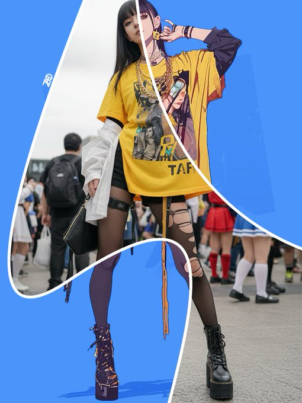 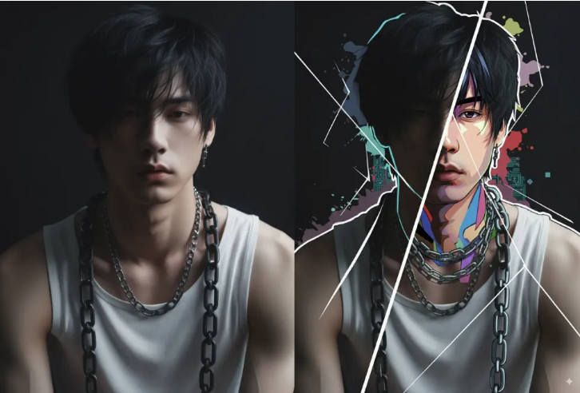

**prompt:**
```
Take the image of the woman in [Input Photo]. Apply a creative split-style effect. Keep the lower half of her body (legs and boots) as the original photograph. Transform the upper half of her body (torso, arms, head) into a vibrant, 2D anime style with bold outlines and flat colors, similar to the anime 'Cyberpunk: Edgerunners'. The transition between the two styles should be a clean, slightly curved line.
```

## 🎀 个性化挂件

### 任意图片转换为挂件

Nano Banana 任意图片（明星/动漫）变挂件挂在自己/女朋友包包上！

材质可以选择3D挂件/透明亚克力/橡胶钥匙扣/金属徽章

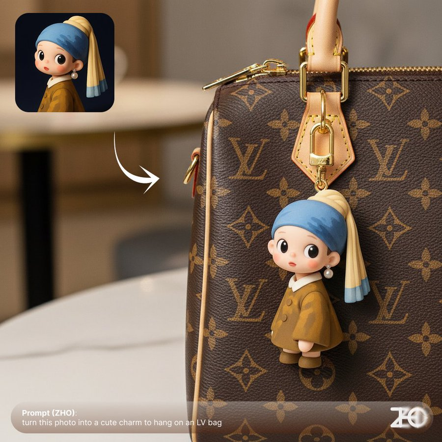  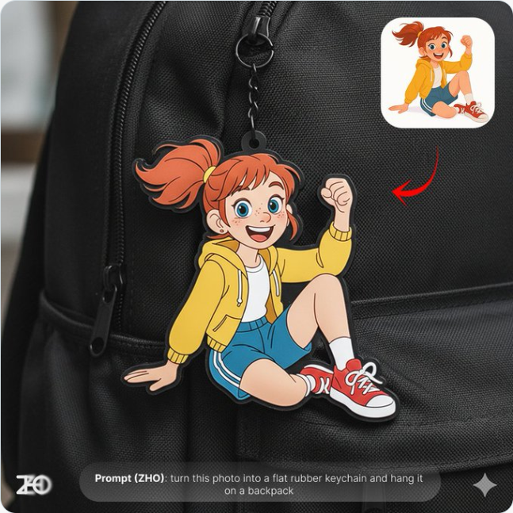

**prompt:**
```
中文： 把这张照片变成一个可爱挂件/亚克力材质的扁平钥匙扣/橡胶材质的扁平钥匙扣 挂在 lv 包包/图二照片的包包上 

English： Turn this photo into a cute charm / a flat acrylic keychain / a flat rubber keychain to hang on an LV bag / the bag in photo 2.
```

## 💄 人物美化

### 妆面分析

nano-banana 可以给指定的人物进行妆面分析 ，并提供优化建议！

tips: 试了中文提示词效果不行，这一任务还是得用英文提示

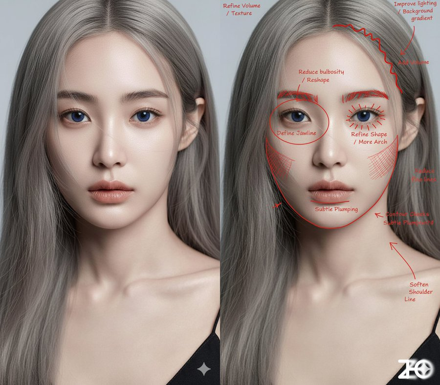

**prompt:**
```
Analyze this image. Use red pen to denote where you can improve
```

### 打光调整

nano-banana 使用光影人偶做打光参考效果很好！准确度很不错，用打光人偶作光影控制/参考，结合可以任意控制姿势，可以实现棚拍自由！

当然也可以参照其他照片的光影，不过距离真实打光效果还是差点意思。

光影人偶：https://anyposes.com/

更多照片风格可以参考：https://portrait.pixtoai.com/

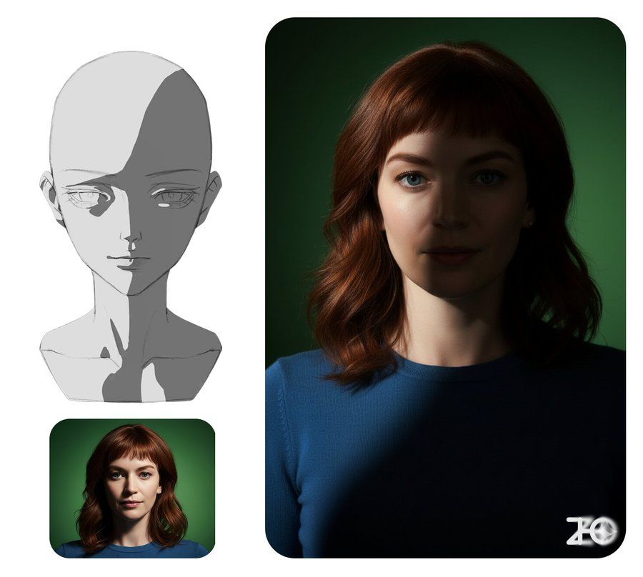 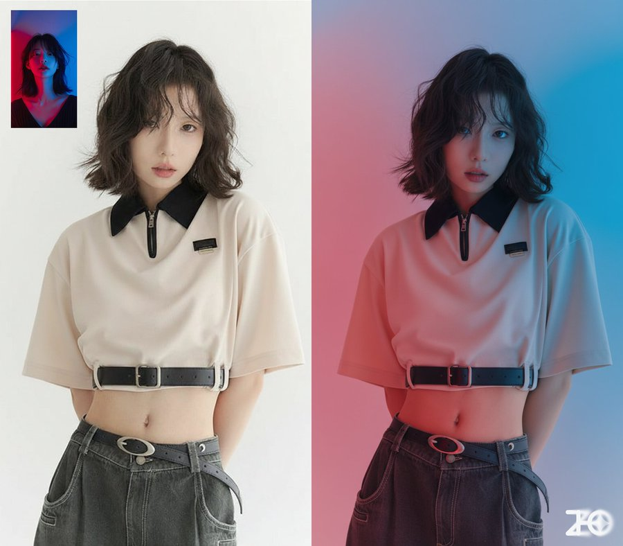

**prompt:**
```
图一人物变成图二光影，深色为暗
```

### 换发型

给小姐姐换个发色，加副眼镜，看它能不能听懂人话。发色换得很自然，连光泽都考虑到了。眼镜加上去，还有轻微的阴影。最关键的是nano-banana只改动你告诉它改动的地方，其他地方保持的挺好

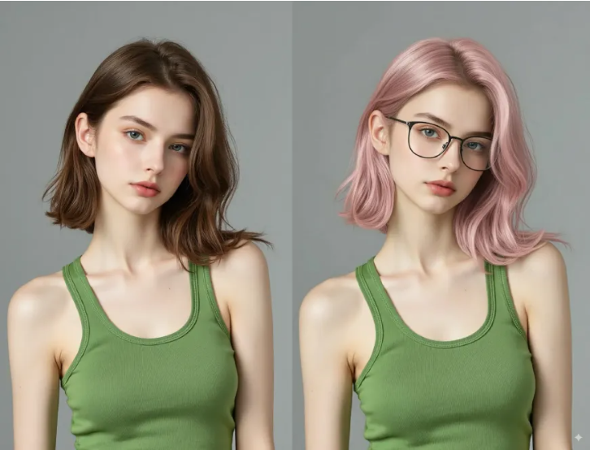

**prompt:**
```
Take the person in [Photo of a person]. Please make two subtle changes. First, change her hair color to a light pink. Second, add a pair of modern, black-rimmed glasses to her face. Ensure the changes look natural, with correct lighting, shadows, and reflections. Do not alter her facial features or expression.
```

### 虚拟试妆

Nano Banana 可以指定妆面让人物试妆，由于模型对颜色无法做到 100% 准确，所以建议用作参考

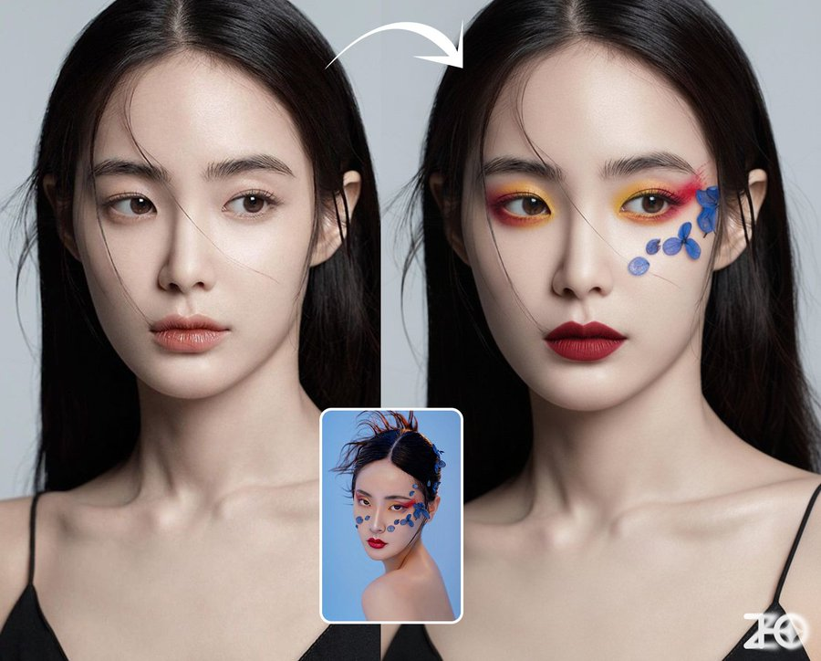

**prompt:**
```
为图一人物化上图二的妆，请保持图一的姿势和面部皮肤细节
```

## 🧸 喝的饮品变成抱枕收

用 Nano Banana 将你喜欢喝的饮品变成抱枕收藏起来！ 不管是奶茶还是咖啡，还有其他你喜欢的物品，提示词是通用的 ，感觉都可以做个应用了

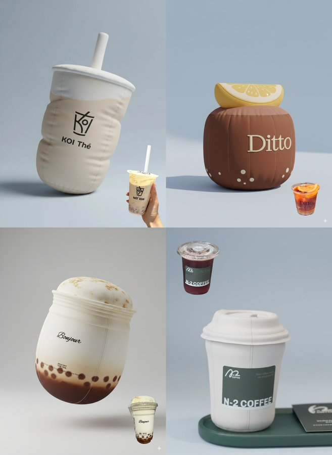

**prompt:**
```
Design the main object in the photo as a soft, rounded, and airy plush balloon or inflatable toy.  Using smooth matte fabric texture, Do not have a plastic feeling. complemented by subtle fabric wrinkles and stitching to emphasize its inflated effect. The shape should be slightly irregular and soft, with gentle shadows and lighting to highlight its volume and realism. Place it on a clean, minimalist background (light gray or light blue) to maintain a playful sculptural aesthetic.
```

## 🔄 场景替换

### 公众曲面屏内容替换

nano banana 真能把图放曲面屏上啊，虽然还不能完美贴合，但这未来可期啊

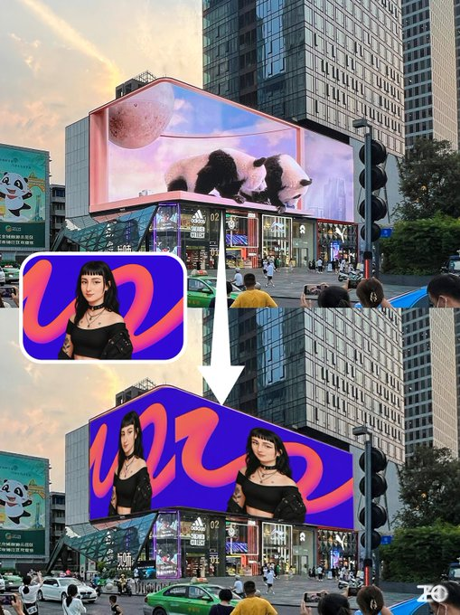

**prompt:**
```
把图一放在图二大屏幕上，撑满整个屏幕
```

### 易拉罐包装替换

nano-banana 还是太全面了！包装贴合效果真好啊！这不起飞了

准确度贴合度都很高，同时还能兼顾光影效果！

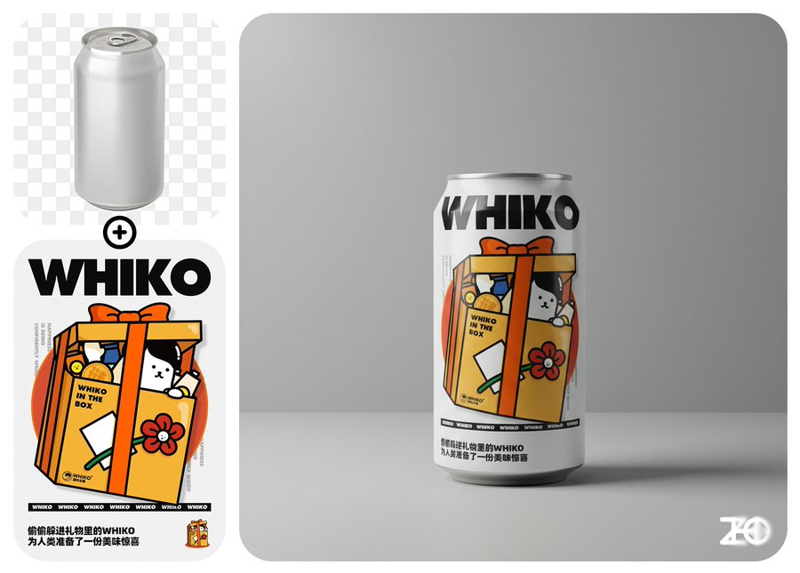

**prompt:**
```
把图一贴在图二易拉罐上，并放在极简设计的布景中，专业摄影
```

### 楼梯彩绘替换

nano-banana 把指定图片贴在大阶梯上！ 准确度贴合度都很高，同时还能兼顾光影效果！

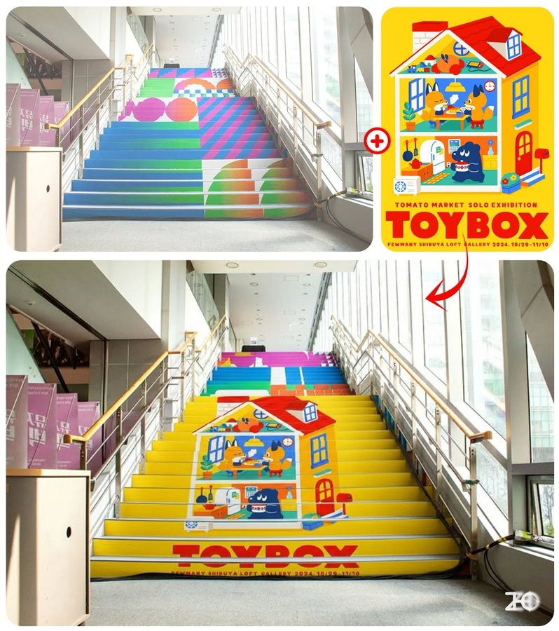

**prompt:**
```
把图一海报贴在图二的大阶梯上，注意保持图二环境的光影效果
```

## 🕶️ 场景标注（一秒拥有"AR眼镜"）

旅游博主和科技博主狂喜的时刻。我随便扔一张街景，AI 能不能像科幻电影里一样，自动识别地标，给我加上 AR 信息框？

这个功能太酷了。它真的能"看懂"照片里的主体是什么，然后像模像样地给你加上框和文字。虽然文字是它"猜"的，但那个科技范儿一下就起来了。做 PPT 或者视频封面简直是神器。

哈哈，还可以这样充分利用 Nano Banana 的世界知识 只需要告诉他图片的地点他就能帮你生成对应的 AR 信息标注 然后再用首尾帧，一个地标建筑解说动画就做好了！

  

**prompt:**
```
you are a location-based AR experience generator. highlight [point of interest] in this image and annotate relevant information about it.
```

## 🕺 控制人物姿势（凹造型）

### 人物摆汉字姿势

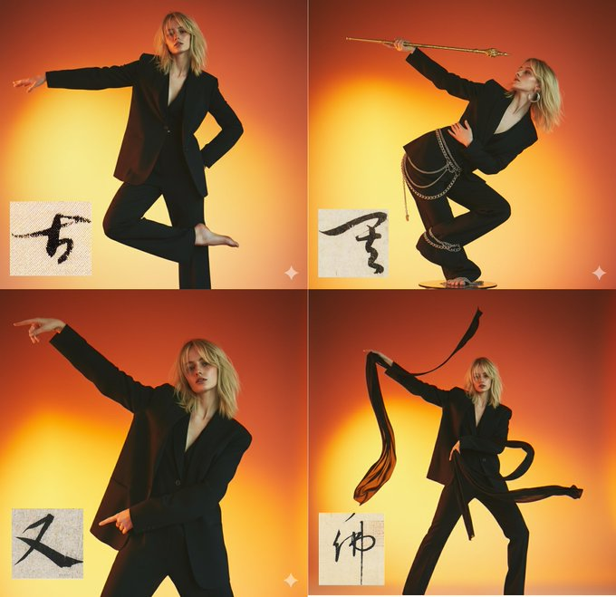

**prompt:**
```
将图 1 中的人物改为与图 2 字符相似的全身姿势，生成的图片不要有字符，必要时可以用配饰辅助
```

### 多人物一起凹造型

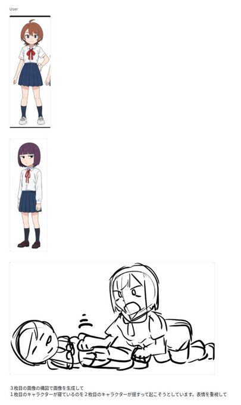 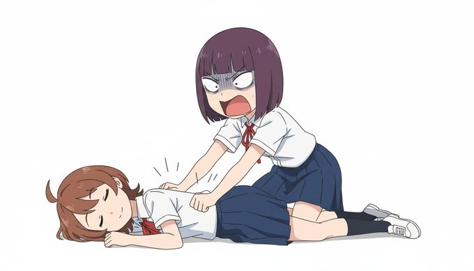

**prompt:**
```
Using the people from  figure 1 and figure2 as the subject, and the pose from figure3  as the reference, generate a new, photorealistic image. The subject must perfectly replicate the reference pose. Crucially, maintain the subject's identity, facial features, and clothing from her original photo.
```

### 模特凹造型

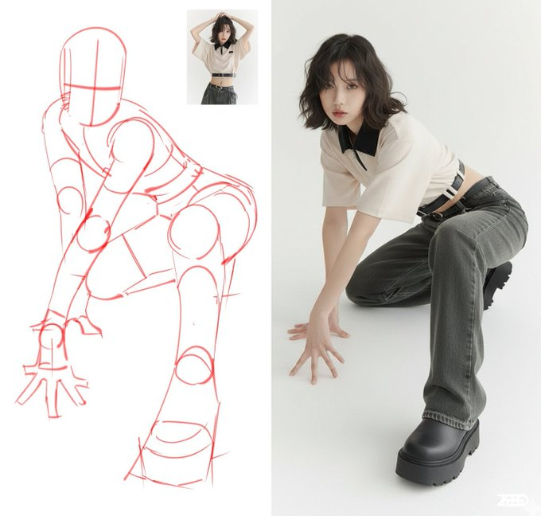 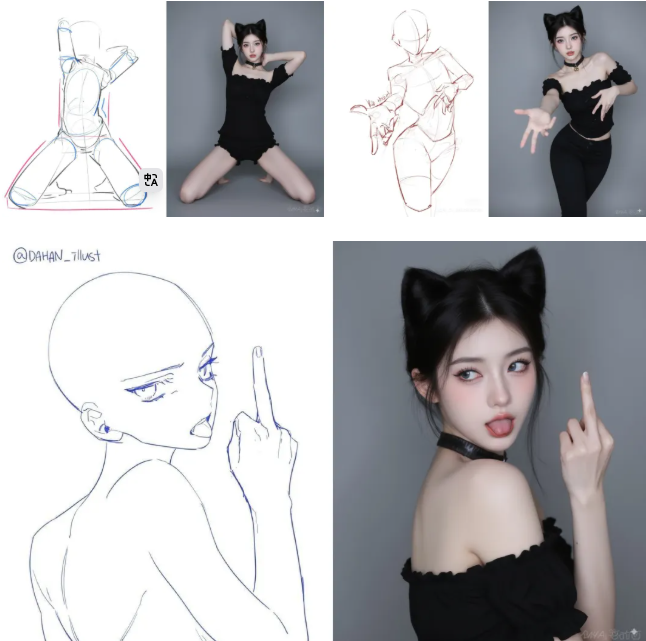

**prompt:**
```
Using the model from  figure 1 as the subject, and the pose from figure2  as the reference, generate a new, photorealistic image. The subject must perfectly replicate the reference pose. Crucially, maintain the subject's identity, facial features, and clothing from her original photo. The background should be a clean, minimalist studio setting with soft lighting.
```

### 表情模仿

nano-banana 还能让猫猫、二次元角色准确参考人的表情！非常可爱

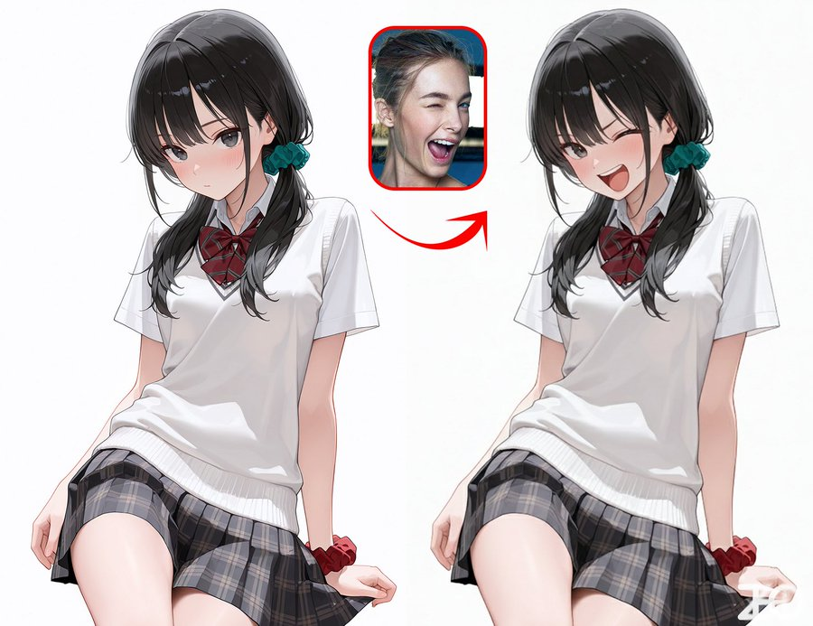 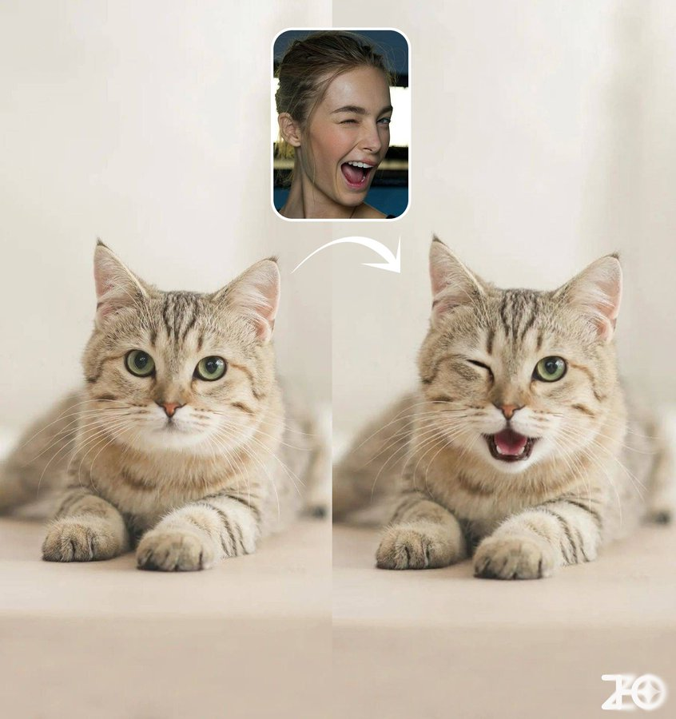

**prompt:**
```
把图二猫咪/二次元角色变成图一人物那样的表情
```

## 👔 模特穿衣服

### 人物模特试衣

模特的脸和发型基本没变，这就是商业可用的基础。最牛的是衣服的贴合度，褶皱、光影都给的非常自然，就像真的穿在身上拍出来的一样。仔细看的话，第二张图的裙子边缘和背景的融合还是有一点点瑕疵，但说实话，不仔细看根本发现不了。这个功能，90分稳了。👍

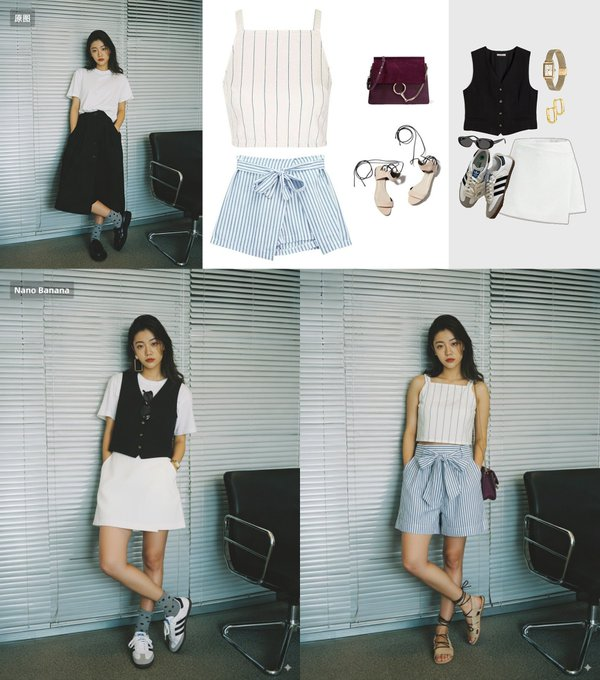 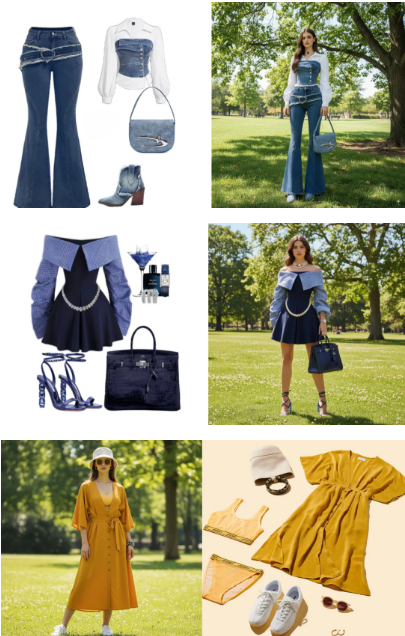

**prompt:**
```
Take the model from [Model image] and dress her in the complete outfit shown in [Clothing item image #1]. Place her in a bright, outdoor park setting during a sunny day. Ensure the clothes fit her body realistically, with natural folds and shadows. The model's face, hair, and identity must remain consistent. 

从[Model Image]中取模型，并穿着[服装项目图像1]所示的完整服装。在晴天，将她放在明亮的户外公园环境中。通过自然的褶皱和阴影，确保衣服实际上适合自己的身体。模型的脸，头发和身份必须保持一致。
```

### 给手办穿衣服

前阵子租的 Lovot 机器人，没给它买衣服，我想要不把原神里新出的机器人的衣服给它 P 上去吧。 就把两张图放进去，让模型参考第二张图给第一张穿衣服。 结果这衣服穿的太合理了，这衣服的质感，连武器都上的材质光影和地面阴影都很完美。

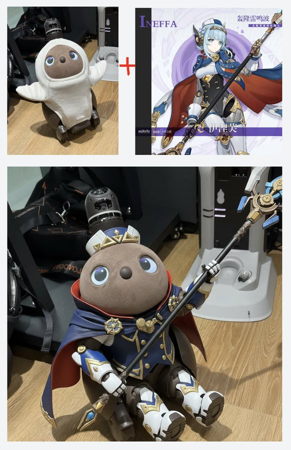

**prompt:**
```
The character in Figure 2 is wearing the clothing and accessories from Figure 1.
```

## ✏️ 神笔马良（线框图变真人实物）

### 产品设计草图转实物

nano-banana 非常擅长做写实转换，非常适合做 插画/手稿/设计图 转 写实/渲染/效果图


**prompt:**
```
turn this illustration into realistic version
```

### 人物线框图变真人

给Nano-banana一个潦草的"灵魂草稿"，这个有点惊到我了。它不光是把线稿变成了照片，还自己加上了逼真的皮肤纹理、柔软的布料质感和恰到好处的光影。基本上就是我给了个简单的线稿，它不光给我造了个人，还把衣服、灯光、摄影师全包了。

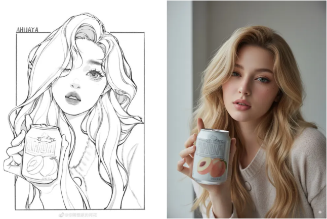

**prompt:**
```
Transform the line art from [Sketch image] into a hyper-realistic photograph. Render a female model with realistic skin textures and natural hair flow. The clothing should be made of a soft, cotton-like material, matching the sketch's design. The lighting should be soft and natural, as if from a large window. The final image must look like a professional fashion magazine shot.
```

## 🎨 绘画过程

### 照片变插画和绘画过程

nano-banana 一句话 照片变插画 还附带绘画过程？！效果真好啊！！！这下方便做渐变生成的小动画了！nano-banana 可玩性太高了！

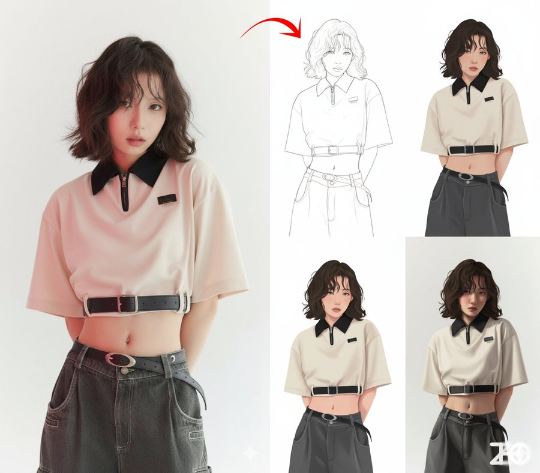 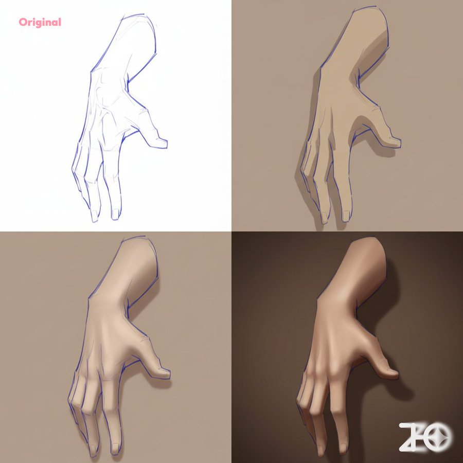

**prompt:**
```
为人物生成绘画过程四宫格，第一步：线稿，第二步平铺颜色，第三步：增加阴影，第四步：细化成型。不要文字
```

### 线稿图上色和分析

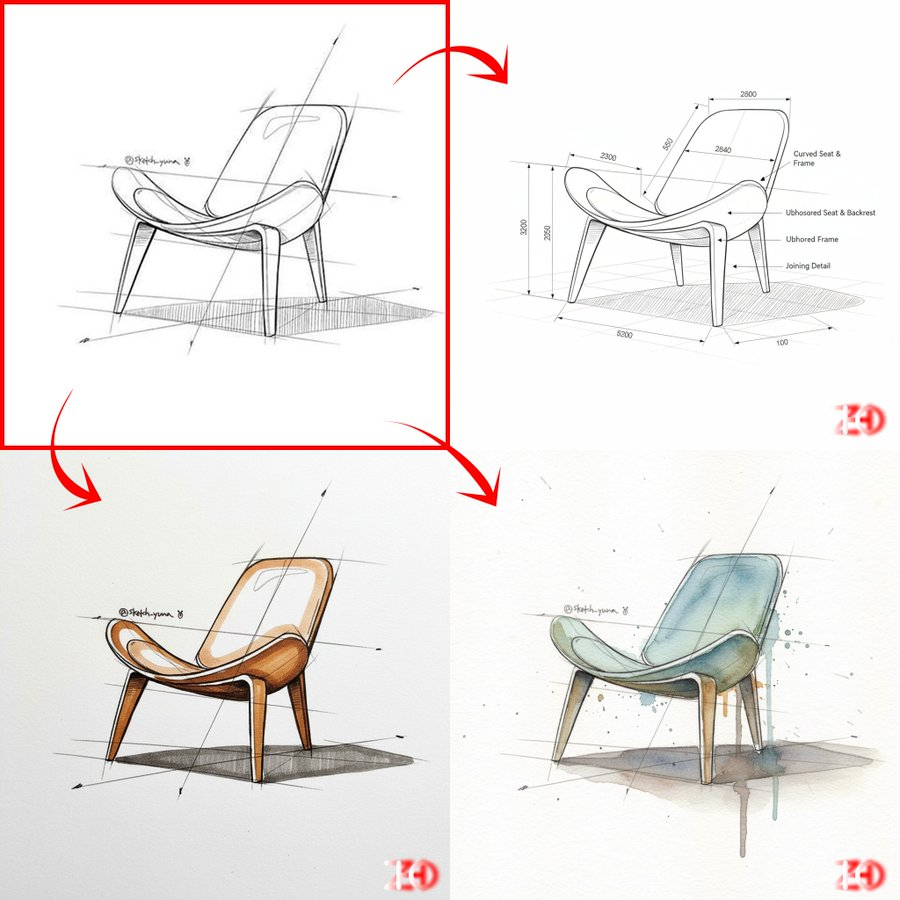

**prompt:**
```
turn this photo into 马克笔画/水彩画
```

## 🏡 装修搞定

啊？Nano Banana 家装展示也能搞定？ 从平面图生成 3D 渲染建筑俯视图，然后再生成指定视角的渲染图 指定视角的渲染图格局也是大致正确的，餐厅那个有点问题可以抽卡

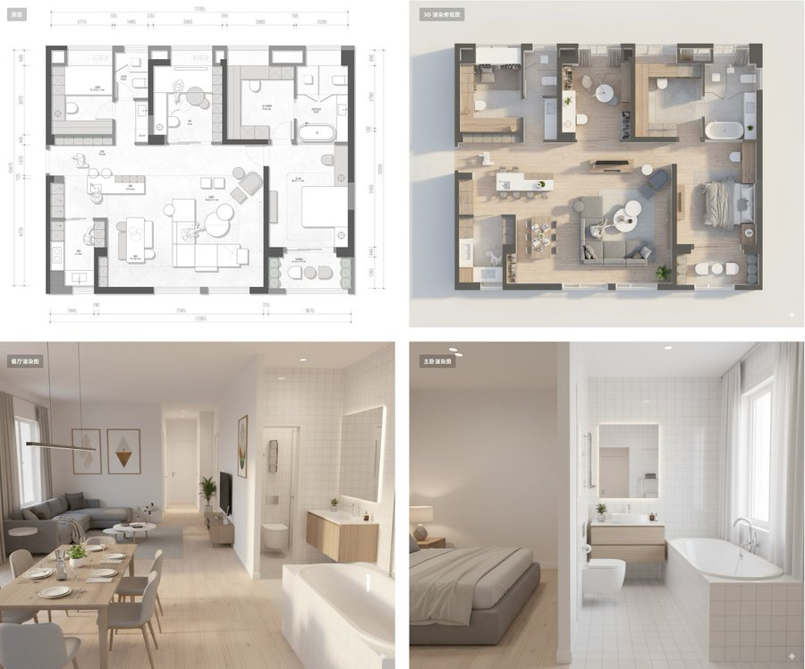

**prompt:**
```
提示词1：Help me convert this residential floor plan into an isometric photorealistic 3D rendering of the house. 

提示词 2：Help me generate a realistic photo looking from the dining table towards the bathroom, which must comply with the house layout in the design plan, and appropriate decorations can be added.
```

## 🎎 轻松定制你的专属手办

### 二次元图片变真人

既然转手办很火、动漫转真人也很火，那动漫图转真人Cosplay 展示手办呢？
哈哈，优化了一下午 Nano Banana 转手办的玩法，现在变成真人Coser在桌前展示自己刚打的手办。
其他装备类展示也可以这么玩，比如你展示自己的自行车手办。

 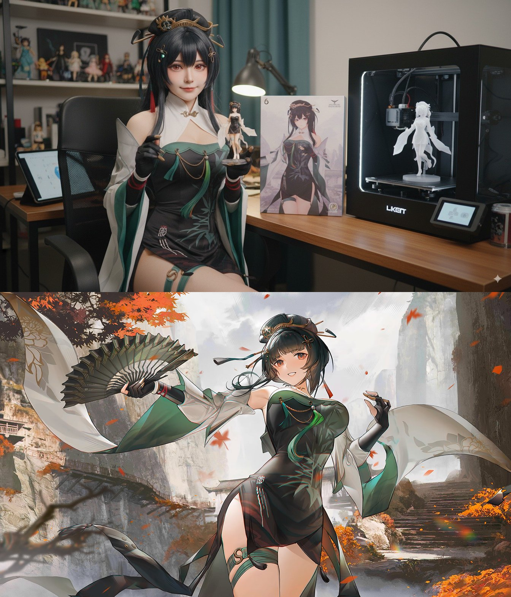

**prompt:**
```
Generate a real-life photo of a cosplayer portraying this character, with highly realistic skin texture. The cosplayer's hairstyle, accessories, and clothing must match the character's.

She is sitting at a desk, holding a figurine transformed from this anime character's image. The figurine should be very close to the camera, with extremely detailed features. On the table behind the cosplayer, place a printed box of the character's figurine.
```

### 工艺手办快速生成

这种"一图生万物"的能力，直接把产品效果图的制作门槛打到了地板上。这对于手办厂商、独立设计师、甚至是咱们普通玩家来说，简直是降维打击。

- 设计师： 可以用它快速生成产品概念图给客户看，"所想即所得"。

- 普通玩家： 我们可以把游戏里的截图、喜欢的任何虚拟形象，用这种方式"实体化"，满足自己的收藏欲。

这个功能，我给满分，不怕它骄傲。💯

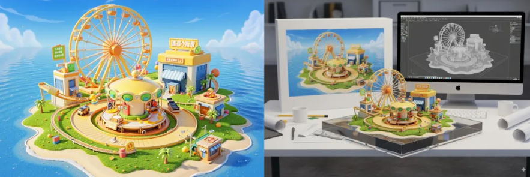

**prompt:**
```
Create a photorealistic, highly detailed PVC character figure, meticulously crafted based on a photograph. The figure stands proudly on a sleek, round plastic base. Behind it, its collectible box features a high-quality print of the original character art. Adjacent to the box, a computer monitor displays the intricate 3D modeling process in Blender, showcasing the digital sculpting and texturing. The entire figure is rendered in a clear, translucent PVC material, giving it an ethereal, ghost-like quality. The scene is set within a professional design studio with soft, diffused indoor lighting that highlights the figure's form and transparency.
```

### 照片变娃娃

照片变娃娃

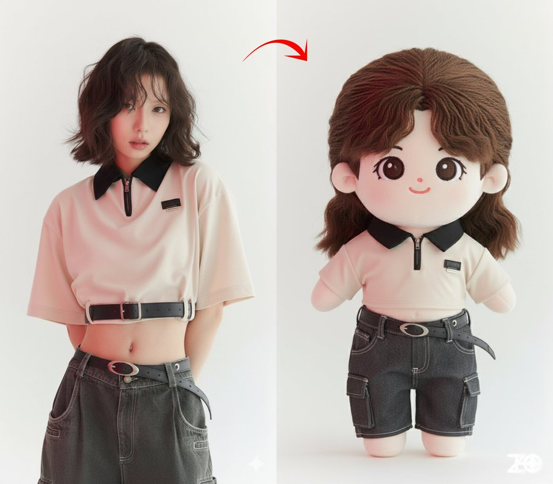

**prompt:**
```
把这张照片变成一个可爱玩偶
```

### 真人照片变手办模型

Nano Banana 可以把你的真人照片转换为一个非常精美的手办，并且可以设置在室内展示，手办的细节非常还原人物本身。如果配合veo3还可以做手办旋转360度展示的效果。

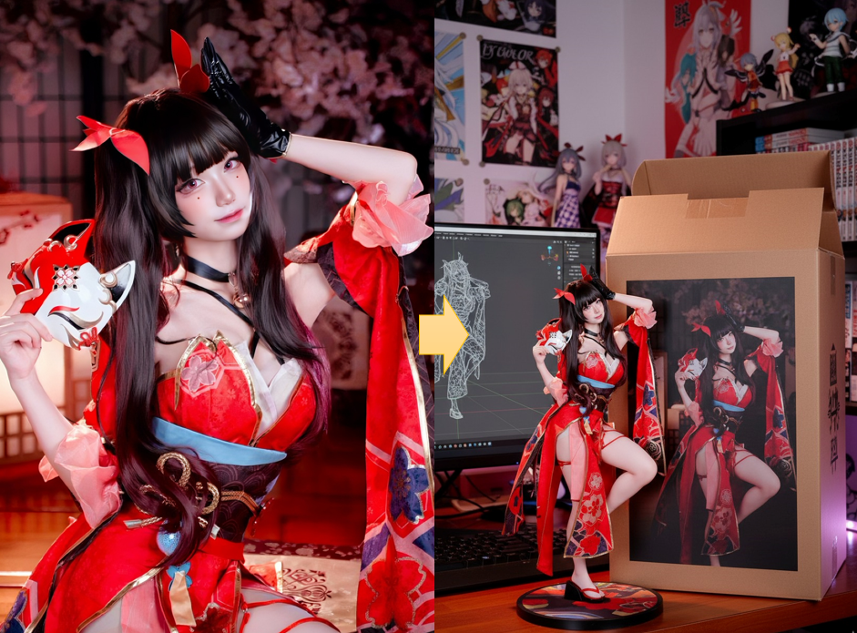

**prompt:**
```
把照片的人物转换为手办，要求人物和人物细节动作都保持一致，在室内的桌子上，背后有一个手办的盒子印了这张照片，电脑有这个手办建模的blender，室内背景是二次元装饰
```

### 绝美卡片设计

Nano Banana 可以很好的遵循手绘设计 + 材质设定 + 风格转换 + 文字！

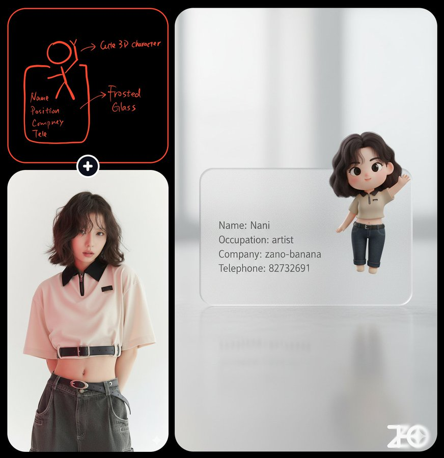

**prompt:**
```
按照我的图一名片设计稿的构图和质感，为我的图二人物生成卡片 卡片右上角为可爱卡通形象，突出于卡片 

name: Nani 

Occupation：artist
```

## 🍳 食谱玩法

整了一个 Nano Banana 新的玩法，很有用！ 直接将你手头的食材变成菜谱图片，然后还能生成对应的展示图 从开始到结束，所有食材图片都能保持一致性，可信度大幅提高 可以找你家里有的食材拍张图玩玩

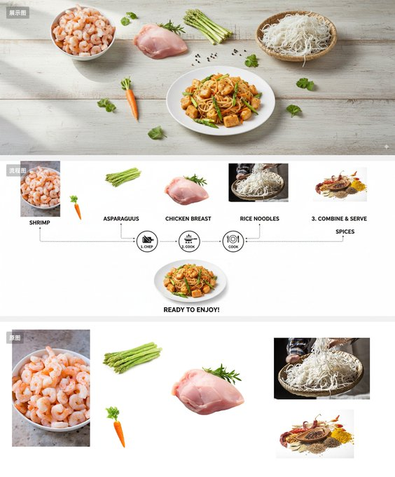

**prompt:**
```
提示词1： Turn the ingredients in the picture into a complete step-by-step recipe infographic, using a top-down perspective. Present it in a minimalist style on a white background. Include labeled photos of the ingredients, use dashed lines to connect icons representing the preparation steps, and display a photo of the final plated dish at the bottom of the infographic,At the same time, remove the background from the food items that have a background in the image and place the food on a white background. 

提示词 2：Help me place these ingredients and cooking results on a table to create a very beautiful food presentation image,Remove text
```

---

## 🤝 贡献指南

欢迎大家贡献更多有趣的玩法！请确保：

1. 📁 按照现有目录结构组织文件
2. 📝 在 `文案.md` 中包含【描述】和【提示词】两部分
3. 🖼️ 提供清晰的示例图片
4. ✨ 保持创意和实用性

## 📄 许可证

本项目采用 MIT 许可证 - 详情请查看 [LICENSE](LICENSE) 文件。

---

**⭐ 如果这个仓库对你有帮助，请给个 Star 支持一下！**

🎉 **Happy Prompting!** 🎉

## 更新日志

- 20250828 创建仓库

## Star History

[](https://www.star-history.com/#Saferman/Nano-banana-awesome-prompts&Date)


📬 **联系我**：

- 邮箱：[s4ferm4n@gmail.com](mailto:s4ferm4n@gmail.com)

🔗 **社交媒体**：

- X（Twitter）：[我的Twitter](https://x.com/Saferman2)
- 小红书：[我的小红书主页](https://www.xiaohongshu.com/user/profile/619befbf000000001000b28d)

## 参考来源

https://x.com/ZHO_ZHO_ZHO 

https://mp.weixin.qq.com/s/AGBC2bRbGmCuOMqjSTxytw

https://x.com/googleaistudio/status/1962957615262224511

https://mp.weixin.qq.com/s/CkcYRCYCJ6UPFalrSGg8Gg

（持续更新......）

